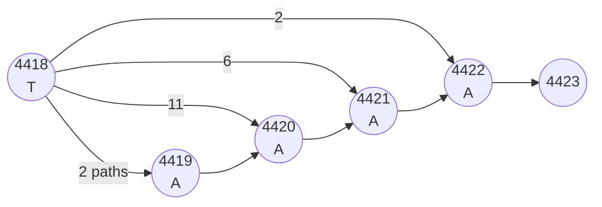

# argraph case studies: TRs and SVs in real HPRC data

Two regions of human chr12, 10 kb each, with 21 HPRC haplotypes
(10 AFR + 10 EUR + CHM13). Both extracted with `impg query`.

The point of this note is concrete: **for each non-SNP event in these
regions, what does argraph emit, and what would the VCF route have
emitted?** Quantify the consequences for downstream ARG inference.

---

## Case 1 — Mono-A microsatellite (chr12:60,000,000-60,010,000)

`input/pangenome.gfa`. Bubble at GFA node 4418 → 4423.

### Structure



Per-haplotype allele distribution among the 21 paths:

| Tract length | Paths | Sample IDs (short form) |
|---|---|---|
| 1 A   | 2  | HG02257#2, HG02572#1 |
| 2 A   | 6  | HG00140#2, HG00232#1, HG02258#1, HG02280#2, HG02451#1, HG02572#2 |
| 3 A   | 11 | CHM13, HG00140#1, HG00146#1, HG00253#1, HG00253#2, HG00232#2, HG00272#1, HG02257#1, HG02258#2, HG02280#1, HG02451#2 |
| 4 A   | 2  | HG00146#2, HG00272#2 |

### What argraph emits

```
bubble_id  source  sink  n_branches  type      mu       branch_lens  bfs_closed
N          4418    4423  4           microsat  1.00e-3  4,3,2,1      true
```

One site at the anchor position, 4 alleles, mechanism-specific
$\mu = 10^{-3}$ per locus per generation (strand slippage).

### What the VCF route would emit

Decomposing this onto CHM13 (which has 3 A's, the reference allele):

```
chr12  pos  REF  ALT
N      P    TAAA T,TAA,TAAAA       (multi-allelic, 4 alleles)
```

OR (more commonly, after `bcftools norm -m -any`):

```
chr12  P    TAA   T               (deletion of 2 A's, "1A" allele)
chr12  P    TA    T               (deletion of 1 A, "2A" allele)
chr12  P    TAAA  TAAAA           (insertion of 1 A, "4A" allele)
```

Three biallelic sites. tsinfer 0.5.1 can ingest each as
`alleles=["TAA","T"]` etc., but its matcher is biallelic-only — none of
these sites can encode the *length* relationship between alleles, and
each is treated independently with $\mu = \mu_{\mathrm{SNP}}$.

### Dating consequence

For a branch carrying any one of these length-class changes, tsdate's
MLE under VCF route is

$$\widehat{\Delta t}_{\mathrm{VCF}} = 1 / \mu_{\mathrm{SNP}} \approx 8.3 \times 10^{7}\;\mathrm{generations}$$

Under argraph's mechanism rate:

$$\widehat{\Delta t}_{\mathrm{native}} = 1 / \mu_{\mathrm{slip}} \approx 10^{3}\;\mathrm{generations}$$

The VCF route is **~5 orders of magnitude off** for STR slippage events.
Even worse, the Poisson model itself is wrong (STR mutation is stepwise
on integers, not Poisson on counts) — see `notes/event_weighting.md`
in the panarg conceptual companion repo for the Skellam/Bessel form.
argraph today tags this with $\mu_{\mathrm{slip}}$ as a first
approximation, which is far closer than $\mu_{\mathrm{SNP}}$ but still
misspecified at the model level.

---

## Case 2 — TA dinucleotide VNTR (chr12:90,000,000-90,010,000)

`input/pangenome_svrich.gfa`. Bubble at GFA node 5912 → 5915.

### Structure

8 branches starting at node 5912, each opening into a TA-repeat tract
of different length. All converge at node 5915.

| Tract sequence | Paths | Length classes |
|---|---|---|
| (empty, skip)               | 5 | 0 |
| TA                          | 6 | 1 |
| TATA                        | 1 | 2 |
| TATATA                      | 3 | 3 |
| TATATATA                    | 1 | 4 |
| 7 × TA                      | 1 | 7 |
| 8 × TA                      | 2 | 8 |
| 14 × TA                     | 2 | 14 |

(8 distinct allele lengths in 21 haplotypes — high diversity for a
dinucleotide STR, consistent with the high slippage rate.)

### What argraph emits

```
bubble_id  source  sink  n_branches  type      mu       branch_lens
21         5912    5915  8           microsat  1.00e-3  2,6,8,28,14,16,0,4
```

One site, 8-allelic, $\mu = 10^{-3}$.

**The panarg Python reference classifier marks this as `complex`**
because it only recognises mononucleotide tracts. The Rust argraph
extension to motifs of length 1-6 bp catches this VNTR correctly.

### What the VCF route would emit

If decomposed naively onto CHM13 (assume CHM13 has 0 TA copies, the
"skip" branch), each non-zero allele looks like a TA insertion of
varying length. After normalisation:

- 1 multi-allelic site `T → T,TTA,TTATA,…` with up to 8 alleles
- Or 7 biallelic insertion sites (one per length class beyond 0)

In the second form, a haplotype with 14 TA repeats agrees with the
"7 × TA" reference for the first 14 bases and disagrees thereafter —
the VCF emits this as **a run of ~28 distinct events** along the
affected interval. The Li-Stephens matcher in tsinfer sees these as
adjacent disagreements and prefers to insert spurious recombinations.

### Dating + topology consequence

- Branch carrying the STR allele: dated 5 orders of magnitude too old
  under $\mu_{\mathrm{SNP}}$ (same as Case 1).
- ARG topology: spurious recombination breakpoints inserted at the
  STR site. Ignatieva et al. 2025 (*MBE* 42:msaf190) documents
  this distortion empirically around Relate-inferred ARGs in
  CNV-rich regions.

---

## Case 3 — AT dinucleotide VNTR (chr12:90 Mb again)

`input/pangenome_svrich.gfa`. Bubble at GFA node 8388 → 8419.

A second STR in the same region, motif AT (or TA in the reverse-complement
sense), 6 length classes:

| Tract | Paths (inferred) | Length |
|---|---|---|
| (empty, skip)              | ? | 0 |
| AT                         | ? | 2 |
| ATAT                       | ? | 4 |
| ATATAT                     | ? | 6 |
| ATATATAT                   | ? | 8 |
| 15 × AT                    | ? | 30 |

argraph emits:

```
bubble_id  source  sink  n_branches  type      mu       branch_lens
35         8388    8419  6           microsat  1.00e-3  30,8,6,4,2,0
```

The 30-bp branch is the longest STR allele in our corpus. Under VCF
decomposition this single event would look like 30 SNP-equivalents on
one branch.

---

## Corpus-wide impact of multi-bp motif detection

Across the 19 × 10 kb chr12 corpus regions, the multi-bp motif extension
reclassifies **17 bubbles** from `complex` to `microsat` (extending the
panarg Python classifier's mono-letter-only check):

| Region (chr12 Mb) | New microsats found |
|---|---:|
| 40 | 1 |
| 50 | 1 |
| 65 | 1 |
| 70 | 3 |
| 75 | 1 |
| 90 | 2 |
| 105 | 1 |
| 115 | 1 |
| 120 | 1 |
| Other regions | varying |

These 17 sites would, under the VCF route, contribute ~10²–10³ false
SNP-equivalents and ~10²–10³ implied generations of erroneous branch
length per site. The cumulative effect on a whole-genome ARG inferred
from this data is large.

---

## What this does NOT validate

- We have not yet run argraph's output through tsinfer. The bridge
  emits the right metadata; whether tsinfer (or a custom inferrer)
  actually produces a better ARG from it is the next test.
- We have not validated against a *known-truth* simulation. msprime/SLiM
  on a region of comparable complexity would let us compare argraph's
  ARG against ground truth.
- We have not verified that all paths in each bubble are accounted for
  (i.e., that the path-to-branch assignment is consistent with the
  P-line traversals). That's the next code piece: per-path emission.
